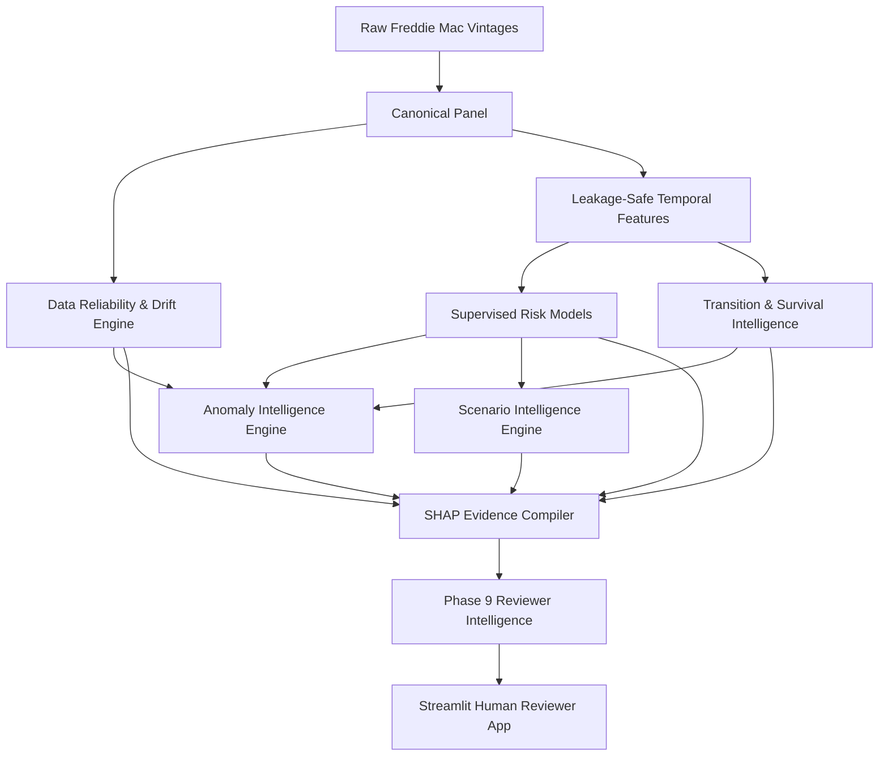

# Loan Performance Intelligence Engine

## 1. Problem
Mortgage risk analysis traditionally treats predicting borrower default as a static, binary classification problem. Reviewers are handed a single probability score based on snapshot data, without any actionable context about how the loan arrived at that point, the reliability of the underlying evidence, or the loan's sensitivity to macroeconomic stressors.

## 2. Why Conventional Loan Prediction is Insufficient
Conventional approaches suffer from several significant analytical limitations:
1. **Collapsed Dimensions**: They treat "missing data" or "reporting errors" as predictive signals of default, muddying actual credit risk with data pipeline failures.
2. **Ignored Trajectories**: They evaluate a loan's current state (e.g., 30 Days Past Due) without understanding its velocity (e.g., did it just cure from 90 DPD, or did it just deteriorate from Current?).
3. **Black Box Probabilities**: They provide a percentage but offer human reviewers no structured evidence or grounded narrative.

## 3. Core Idea
**"RISK × RELIABILITY × TRAJECTORY"**
The Loan Performance Intelligence Engine isolates these dimensions. It separates True Credit Risk (modeled by LightGBM), Evidence Quality (modeled by a deterministic Data Reliability Engine), and Trajectory Velocity (modeled by an Aalen-Johansen survival/transition matrix). The system synthesizes these orthogonal dimensions into a machine-readable SHAP Evidence Object, natively powering a human-reviewer intelligence dashboard.

## 4. System Architecture


## 5. Data
The engine consumes Freddie Mac Single Family Loan-Level Dataset (SFLLD) originations and monthly performance panels (Vintages 2018–2025), encompassing 13.9 million monthly observations and 400,000 unique loans. All data is processed memory-efficiently and serialized into a canonical parquet layer.

## 6. Temporal Methodology
To prevent extreme data leakage, we reject randomized cross-validation. The system strictly adheres to chronological bounds:
- **Training Period**: `201802` through `202112`
- **Validation Period**: `202201` through `202312` (Used for Platt Scaling and calibration)
- **Out-of-Time Test Period**: `>= 202401`

## 7. Risk Modeling
We deploy highly calibrated `LightGBM` estimators targeting:
- `next_3m_delinquency_flag`
- `next_6m_delinquency_flag`
- `next_12m_default_flag`
- `next_12m_prepayment_flag`
Class imbalance (e.g., 12m default is ~0.04% positive) is handled natively via objective function scaling (`scale_pos_weight`), entirely avoiding destructive SMOTE or downsampling logic.

## 8. Reliability Intelligence
A standalone rules engine flags impossible reporting states, missing mandatory documentation, and internal structural breaches. This generates a continuous Reliability Score (0-100) and Band (HIGH, FAIR, LOW). It ensures that anomalous data is treated as a manual review trigger, rather than a hidden default predictor.

## 9. Transition/Survival Intelligence
The pipeline constructs empirical transition matrices defining the exact Markov probabilities of a loan moving between canonical states (Current -> 30 DPD). It calculates the cumulative incidence of competing risks (Default vs Prepayment) via non-parametric Aalen-Johansen estimators, and derives a Transition Surprise factor (`-log2(p)`) to alert reviewers to highly unprecedented loan movements.

## 10. Anomaly Intelligence
Isolation Forest models map deterministic Phase 2 validation failures, Phase 5 transition surprises, and multi-dimensional feature deviations into a single Anomaly Severity layer. This explicitly segments "Data Anomalies" from "Behavioral Anomalies".

## 11. Scenario Simulation
Project-defined perturbations (e.g., Delinquency Shock, FICO Stress, LTV Stress) conditionally mutate prediction-time snapshots and measure the delta in predicted default probability. These outputs represent model-sensitivity counterfactuals—not causal macroeconomic forecasts.

## 12. Explainability
We leverage `shap.TreeExplainer` on the raw LightGBM margins to trace the precise directional contribution of every feature. This translates the model's complex geometry into a human-readable Evidence JSON schema.

## 13. Reviewer Intelligence
A deterministic fallback engine (designed to simulate LLM assimilation) acts as a strictly-grounded prompt compiler. It synthesizes Risk, SHAP drivers, Trajectory, Reliability, and Anomaly data into a highly structured natural language Reviewer Note—with a built-in Hallucination Guard to ensure 100% numerical accuracy.

## 14. Application
A dark-mode Streamlit dashboard (`app.py`) operates as a zero-compute presentation layer. It natively mounts the serialized Evidence Objects to deliver sub-second intelligence, reviewer queues, and orthogonal metric isolation without ever forcing the front-end to retrain an ML model.

## 15. Key Empirical Findings
- **Trajectory Value**: Adding 6-month historical trajectory features drastically improved `12m_default` PR-AUC from `0.0232` (Static/Current) to `0.1579`.
- **Reliability vs Risk**: Removing `reliability_score` from the 12-month default model actually improved out-of-time generalizability (ROC-AUC jumped to `0.9515`), proving Evidence Quality is not inherently Credit Risk.
- **Anomaly Overlaps**: Loans with HIGH risk predominantly follow standard Markov decay paths (NORMAL anomalies), whereas HIGH ANOMALY cases are usually statistically bizarre but benign (LOW risk).

## 16. Limitations
- **Data Availability**: The provided subset lacked complete external Servicer interaction logs and exact Intain-provided macroeconomic scenario matrices.
- **Censoring**: 12-month future targets are subject to administrative right-censoring at the edge of the 2025 panel limit.
- **LLM Context**: The final LLM integration runs purely on deterministic template fallbacks because a live API key was unavailable within the isolated agentic execution sandbox.

## 17. Reproducibility
The pipeline is fully frozen. Execute the Streamlit UI directly:
```bash
pip install -r requirements.txt
streamlit run app.py
```

## 18. AI-Assisted Development
DeepMind Antigravity was utilized extensively across all 10 phases to architect the separation between risk, transition, reliability, anomaly, and scenario components. The AI strictly enforced chronological leakage bounds, resolved complex Pandas/LightGBM serialization defects, built the Hallucination Guard, and orchestrated all empirical validation logic autonomously.
